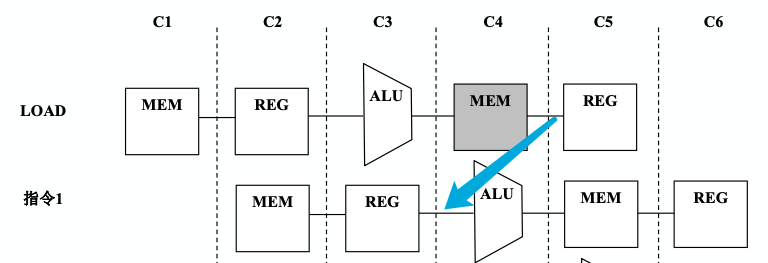
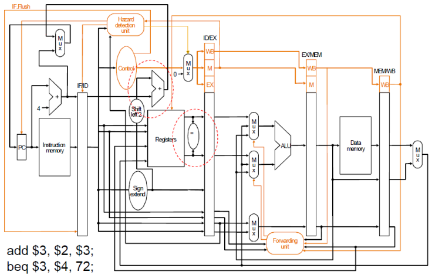
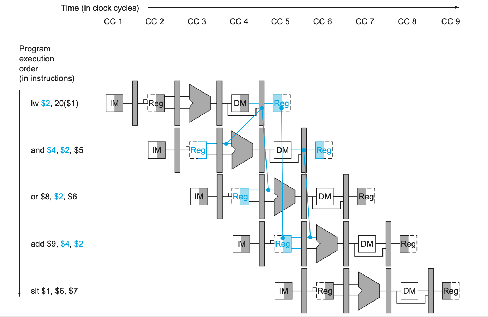

# Summary for lab 5

by 鸢一折纸

## 关于流水线：

为什么流水线会比多周期麻烦辣么多？因为···~~你看看讲了多少节课鸭~~

### 相关（hazard，冒险；dependencies，依赖）

- 结构相关:当指令在重叠执行的过程中，硬件资源满足不了指令重叠执行的要求，发生资源冲突 时将产生结构相关
	- 这个好办，~~充钱可以解决一切问题~~，增加相应的部件就好了（比如哈佛结构）
- 数据相关:当一条指令需要用到前面指令的执行结果，而这些指令均在流水线中重叠执行时，就 可能引起数据相关
	- 编译技术:插入nop，指令重排，寄存器重命
	- forwarding技术
	- Interlock技术
- 控制相关:当流水线遇到分支指令和其他会改变 PC值的指令时，会发生控制相关
	- 编译技术:延迟分支
	- 硬件优化:提前完成，投机，预测

---

> **为什么要有forwarding / bypassing？**

为了让一些指令（比如`add`的**WB**段）不和之后指令产生数据相关（RAW）。直白来说就是让指令**真正用到数据**的地方用到正确的数据

- RAW的判断规则：
	- EX：EX/MEM.RegisterRd=ID/EX.RegisterRs
	- EX：EX/MEM.RegisterRd=ID/EX.RegisterRt
	- MEM：MEM/WB.RegisterRd=ID/EX.RegisterRs
	- MEM：MEM/WB.RegisterRd=ID/EX.RegisterRt

不会出错的数据是寄存器的编号（废话这都写在指令里面了）

会出错的有**R-type**的运算结果 (EX)，访存指令的地址 (MEM)，

> **Interlock**

有的指令冲突依然无法通过旁路来解决，故将流水线数据依赖位置之前的段冻结，并在后面的段插入气泡

- `if (IF/ID.MemRead && ((ID/EX.RegisterRt == IF/ID.RegisterRs) || (ID/EX.RegisterRt == IF/ID.RegisterRt)))`
- 增加两个控制信号：PCWrite 和 IF/IDWrite
	- 阻止更新 PC 和 IF/ID，使之进行相同的操作（保持正确的译码结果）
	- 为了避免后面段重复执行
- 将 ID/EX 的控制信号清零，即 EX 段暂停一个周期

> **关于Hazard detection unit**

作用见上面的interlock

我会放上去三种解法：BEQ在EX段结束；BEQ在ID结束，两次nop；BEQ在ID结束，一次nop，完全转发，请按需自取

CAUTION !!!

下面COD里面的这个适用于BEQ在EX段结束时跳转

- 这个判断条件原理如这个图所示
- 
- 访存目标寄存器恰好在下一条指令的EX段需要用到，但MEM段 (而不是像算术指令那样EX) 才产生结果，故只得💭
- `if (ID/EX.MemRead and
	  ((ID/EX.RegisterRt = IF/ID.RegisterRs) or
	 (ID/EX.RegisterRt = IF/ID.RegisterRt))) stall the pipeline`
- (不是BEQ / BNE / SW) 的`I`类型指令和`J`类型指令无须考虑 `ID/EX.RegisterRt = IF/ID.RegisterRt` 这个条件 (因为rt操作数是写回目标寄存器)

如果BEQ在ID段就有可能需要nop💭两个周期 (LW+BEQ)

- 在上面的基础上需要把BEQ、BNE指令nop两个周期 (或者将bypassing拓展到ID段去，并💭一个周期)
- 这个我是在解决不了了Orzzzzzzzzzzzz我没有办法让左边那个寄存器堆等一整个mem时间再读进去并把值传递给beq。。。不过我觉得吧时钟周期那么长，还是可以接受的 (事实证明可以)
- 【注】SW也可以不💭：加一个从WB到MEM的forwarding就可以了。。

### 控制信号

> **关于jump**

那里面没有实现 jump

最高4位是取PC还是PC+4呢（（

当然是PC+4了（多周期用PC是因为第一个周期不是已经把PC变成PC + 4了嘛）注意多周期的PC是在从上一条指令的第二个周期保持到自己的第一个周期

> **关于PCwe**

PCen同时受 rst、 jump | zero & branch (来源于跳转指令) 和 PCWrite (来源于冒险处理) 控制

其中跳转的优先级高于PCwrite (nop锁存是为了执行接下来的指令，都要跳转了为啥不刷新PC呢。。)

总之：处理BEQ取数寄存器数据冲突 (LW+BEQ) > 跳转执行 > 处理EX需要用到数据的数据冲突 > 普通PC+4

> **关于ID/EX的flush**

尽管清0了它也都是控制信号鸭···不会继续执行产生什么影响嘛···

首先所有写入使能都是0，所以不会修改存储下来的数据；其次ID/EX.MemRead是0，则hazard控制单元不工作产生影响；再次RegWrite信号都是0，所以forwarding单元也不工作···

> **关于Forward unit**

实现如下：（摘自COD 5th 4.7）

- EX *hazard*
	- `if (EX/MEM.RegWrite
		 and (EX/MEM.RegisterRd ≠ 0)
		 and (EX/MEM.RegisterRd = ID/EX.RegisterRs)) ForwardA = 10`
	- `if (EX/MEM.RegWrite
		 and (EX/MEM.RegisterRd ≠ 0)
		 and (EX/MEM.RegisterRd = ID/EX.RegisterRt)) ForwardB = 10`
- *MEM hazard:*
	- `if (MEM/WB.RegWrite
		 and (MEM/WB.RegisterRd ≠ 0)
		 and (MEM/WB.RegisterRd = ID/EX.RegisterRs)) ForwardA = 01`
	- `if (MEM/WB.RegWrite
		 and (MEM/WB.RegisterRd ≠ 0)
		 and (MEM/WB.RegisterRd = ID/EX.RegisterRt)) ForwardB = 01`
- MEM *hazard* (considering EX)
	- `if (MEM/WB.RegWrite
		and (MEM/WB.RegisterRd ≠ 0)
		and not(EX/MEM.RegWrite and (EX/MEM.RegisterRd ≠ 0)
			and (EX/MEM.RegisterRd ≠ ID/EX.RegisterRs))
		and (MEM/WB.RegisterRd = ID/EX.RegisterRs)) ForwardA = 01`
	- `if (MEM/WB.RegWrite
		and (MEM/WB.RegisterRd ≠ 0)
		and not(EX/MEM.RegWrite and (EX/MEM.RegisterRd ≠ 0)
			and (EX/MEM.RegisterRd ≠ ID/EX.RegisterRt))
		and (MEM/WB.RegisterRd = ID/EX.RegisterRt)) ForwardB = 01`

> **关于IF.Flush**

好多人不知道这是干什么的 (包括我)···

想一下延迟槽 (就是转移指令后面预执行的那一部分)，读进去的指令会在跳转成功之后继续执行，所以需要把它踢出去

有大佬说可以把这个信号和 hazard detection unit 的清空ID/EX寄存器信号合并，但是需要修改一下两个控制单元···

### 指令

> 关于BEQ

BEQ指令可以用 3个周期，或者2个周期。两个周期的好处当然是延迟槽变浅了，但是对于相关的处理会出现一些问题。。

考虑一下这个冒险：

当BEQ指令的一个数据来源寄存器是上一条指令的写回目标寄存器，就。。。

### 访存

没有写数据的port···自己从ID/EX段间寄存器引B出来

### 关于ALU的B操作数

ForwardB 这个控制信号不能和 ALUSrc 合并！！！因为这涉及到有的 I-type 指令需要用到寄存器堆的读portB (没错就是你`sw`)，但是由于转发，实际上应该读的是 ForwardB 信号筛选之后的那个数据 final_b (但是这个信号不会进ALU，而是立即数进去了) 所以，这个时候`sw`需要写进去的数据就被冲掉了……

解决方案是用两个MUX…一个用来forward确定read_port_B的最终正确值，另外一个用来在这个转发结果和立即数直接选择，确定ALU_B的值

## 坑

所有调用模块都需要一个wire类型变量来链接输出端口！！！

> 关于红字 XXXXXXX.....

首先，红字代表未知或者不确定的信号

有以下已知可能错误原因

1. 多驱动，数据冲突 (有两个或以上的输入，且没有多选器)
2. 没有初始化 (加 **rst** 信号或者 **initial** 赋初值)
3. 信号位宽不符 (有时候也会变成高阻态)
4. 存储器访问到了垃圾地址

> 关于MUX

自己走一遍哪个口是1还是0要和控制单元一致！！！

~~端口太多会使人忘记写out (确信)~~

> 关于寄存器内部转发

由于寄存器堆写是需要一个时钟上升沿的，所以实际上寄存器值的改变是在WB段之后，如图所示

所以为了寄存器内部数据正常可用，则可以在写入的时候就转发到输出端口处 (我集成在了reg_file内部)，如下图中的reg到reg的转发：

> **关于分支语句**

case和if语句要写全···指else和default···不然真的会出不知道什么奇怪的bug···我个人的习惯是置高阻态，方便调试

> **关于赋值**

一定一定一定要记住，assign和always@(*)用阻塞赋值`=`，always@(posedge clk)用非阻塞赋值`<=`。。。

> **关于判断是不是0**

好吧我觉得这个除了我都知道···`|Sig` (按位或) 等价于 `Sig != 0`，如果这个信号是1位的还可以`~Sig`

### 在你觉得成功的时候，来看一下这里：

对于lab3的那个测试文件，有可能会由于BEQ指令的两个操作数都没有加载进去所以都是0···

